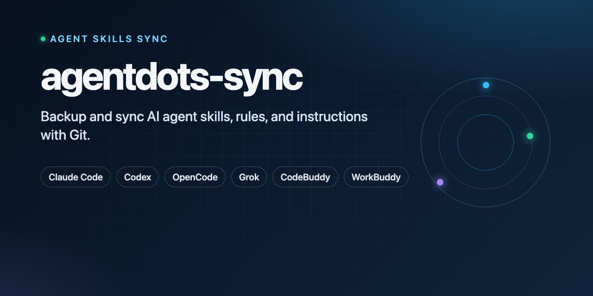

# agentdots-sync

<p align="right">
  <b>English</b> | <a href="./README.zh-CN.md">简体中文</a>
</p>

<p align="center">
  
</p>

<p align="center">
  <a href="https://github.com/ferbylv/agentdots-sync/blob/main/LICENSE"></a>
  <a href="https://www.python.org/"></a>
  <a href="https://github.com/ferbylv/agentdots-sync/releases"></a>
  <a href="https://github.com/topics/agent-skills"></a>
</p>

Backup and sync local AI agent **skills**, **rules**, and instruction files (`AGENTS.md`, `CLAUDE.md`) with a Git remote. Profiles cover Claude Code, Codex, OpenCode, Grok Build, CodeBuddy, and WorkBuddy.

The tool copies files; it does not convert instruction formats between platforms.

## Contents

- [Install](#install)
- [Supported profiles](#supported-profiles)
- [Safety model](#safety-model)
- [Requirements](#requirements)
- [Inspect profiles and prerequisites](#inspect-profiles-and-prerequisites)
- [Apply, push, and rollback](#apply-push-and-rollback)
- [Testing and release checks](#testing-and-release-checks)

## Install

```bash
npx skills add ferbylv/agentdots-sync
```

```bash
gh skill install ferbylv/agentdots-sync
```

```bash
git clone https://github.com/ferbylv/agentdots-sync.git
python3 skills/agentdots-sync/scripts/sync.py --list-platforms
```

## Supported profiles

| Profile | Default root | Default assets | Notes |
| --- | --- | --- | --- |
| `codex` | `~/.codex` | `AGENTS.md`, `rules`, `skills` | Preserves the existing `.codex_backups` location. |
| `claude-code` | `~/.claude` | `CLAUDE.md`, `rules`, `skills` | Alias: `claude`. |
| `opencode` | `~/.config/opencode` | `skills` | Select configuration files explicitly because they may contain environment-specific values. |
| `grok-build` | `~/.grok` | `skills` | Alias: `grok`; select configuration files explicitly. |
| `codebuddy-code` | `~/.codebuddy` | `rules`, `skills` | Alias: `codebuddy`. |
| `workbuddy` | explicit | `skills` | Point `--root` at an unpacked local skill/package workspace; WorkBuddy UI import remains a separate step. |
| `custom` | explicit | explicit | For another Agent Skills-compatible layout. |

These defaults target user-level assets. For a project profile, pass the project as `--root` and select exact project-relative paths with repeated `--asset` options.

Profile layouts follow the current official documentation for [Claude Agent Skills](https://platform.claude.com/docs/en/agents-and-tools/agent-skills/overview), [OpenCode Skills](https://opencode.ai/v2/docs/skills/), [Grok Build Skills](https://docs.x.ai/build/features/skills-plugins-marketplaces), [CodeBuddy Code Skills](https://www.workbuddy.cn/docs/cli/skills), and [WorkBuddy skill import](https://www.workbuddy.cn/docs/workbuddy/From-Beginner-to-Expert-Guide/Function-Description/Skills-Market). Re-check those sources before a release because platform directories and import behavior can change.

## Safety model

- Planning, profile listing, and diagnostics are read-only.
- Mutating modes require `--yes`.
- Existing selected local assets are backed up before apply, restore, or rollback replacement.
- Rollback uses a validated manifest and restores only requested assets present in that manifest.
- Mutating commands are serialized per root with `.meta-sync-lock`.
- Selected assets cannot escape the root or use absolute/cross-boundary symlinks.
- Push stages and verifies only selected paths; it never force-pushes.
- Errors redact common URL credentials, bearer tokens, and credential query parameters.

## Requirements

- Python 3.9 or newer.
- Git on `PATH` for remote operations.
- A local execution surface with access to the selected root. Browser-only chat products cannot use this tool to synchronize files on the user's computer.

## Inspect profiles and prerequisites

```bash
python3 skills/agentdots-sync/scripts/sync.py --list-platforms
python3 skills/agentdots-sync/scripts/sync.py --platform claude-code --doctor
python3 skills/agentdots-sync/scripts/sync.py --platform opencode --plan
python3 skills/agentdots-sync/scripts/sync.py --platform claude-code --apply --plan \
  --remote https://example.com/account/agent-assets.git --branch main
```

The default platform remains `codex`, so existing commands without `--platform` keep their previous root, assets, and backup location.

## Apply, push, and rollback

Run a plan first and verify its canonical platform, root, asset list, backup directory, remote, and branch. Then run only the explicitly approved operation:

```bash
python3 skills/agentdots-sync/scripts/sync.py --platform claude-code --restore --yes \
  --remote https://example.com/account/agent-assets.git --branch main

python3 skills/agentdots-sync/scripts/sync.py --platform grok-build --push --yes \
  --remote https://example.com/account/agent-assets.git --branch main \
  --message "Update Grok skills"

python3 skills/agentdots-sync/scripts/sync.py --platform codebuddy-code --rollback --yes
```

Override defaults when needed:

```bash
python3 skills/agentdots-sync/scripts/sync.py --platform custom --root /path/to/agent-config \
  --asset instructions.md --asset skills --plan

python3 skills/agentdots-sync/scripts/sync.py --platform opencode --root /path/to/project \
  --asset AGENTS.md --asset .opencode/skills --plan
```

`--backup-dir` accepts only a safe child path within the selected root. Non-Codex profiles use `.meta-sync-backups` by default.

## Testing and release checks

```bash
python3 -m unittest discover -s tests -v
python3 skills/agentdots-sync/scripts/sync.py --help
python3 skills/agentdots-sync/scripts/sync.py --list-platforms
```

Before publishing, validate `skills/agentdots-sync/SKILL.md`, inspect the release file list, and test each platform profile in an isolated temporary root. Do not include `.DS_Store`, credentials, real remotes, generated backups, or lock files.
